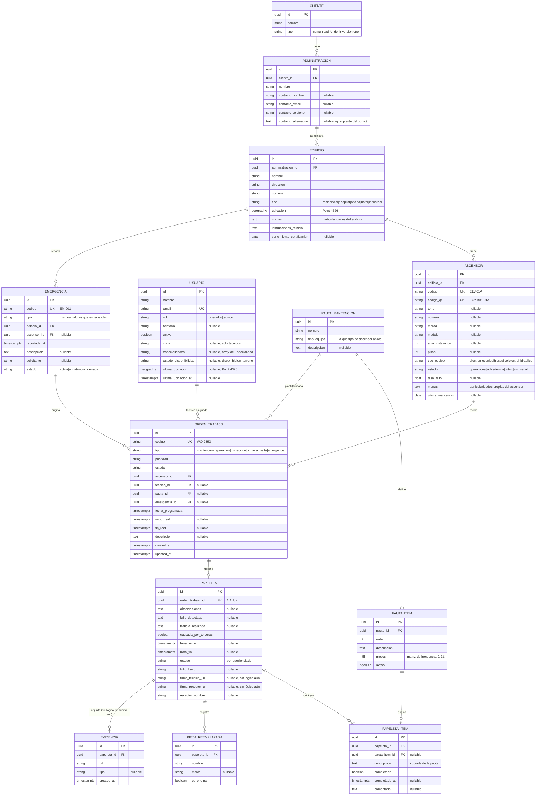

# Modelo ER — Facylitech

Generado a partir de `backend/app/infrastructure/db/models.py` (migración `0001_initial`).
Jerarquía de 4 niveles validada con el cliente: **Cliente → Administración → Edificio → Ascensor**.

## Notas de diseño

- **"Vencido" no es un estado ni columna almacenada**: se calcula en tiempo de
  lectura a partir de `orden_trabajo.estado` y `fecha_programada`
  (`app/domain/semaforo.py`). El semáforo no tiene color propio para
  `cancelado`; se muestra como `completado` (ver más abajo).
- **`meses` en `pauta_item` (RNF-04)**: el checklist se maneja con datos, no
  con código — `app/domain/pauta.py::items_del_mes()` filtra qué ítems
  corresponden al mes en curso al crear la papeleta.
- **La bitácora del ascensor no es una tabla**: es la consulta
  `GET /ascensores/{id}/bitacora` sobre `orden_trabajo` completadas + su
  `papeleta` + `pieza_reemplazada`.
- **Campos preparados sin lógica aún**: `usuario.ultima_ubicacion`,
  `evidencia`, `papeleta.firma_*_url`, `papeleta.folio_fisico` — modelados
  para octubre (tracking GPS, Supabase Storage, firma no vinculante) sin
  implementar su comportamiento.
- Todas las PK son UUID generadas en la aplicación (no se usa `uuid-ossp` ni
  `pgcrypto` en la BD).
- Índices GiST sobre `edificio.ubicacion` y `usuario.ultima_ubicacion`.
