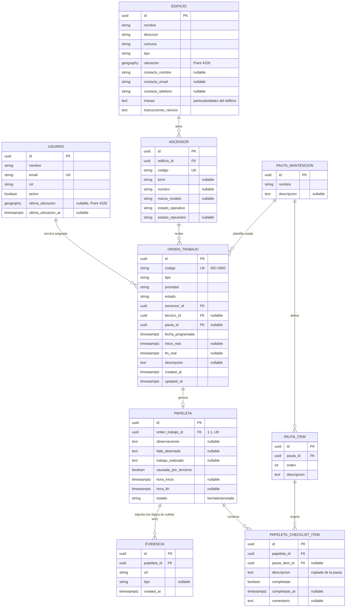

# Modelo ER — Facylitech

Generado a partir de `backend/app/infrastructure/db/models.py` (migración `0001_initial`).

## Notas de diseño

- **"Vencido" no es un estado ni columna almacenada**: se calcula en tiempo de
  lectura a partir de `orden_trabajo.estado` y `fecha_programada` (regla de
  dominio en `app/domain/semaforo.py`). El semáforo (`completado` | `vencido` |
  `en_curso` | `programado`) no tiene un color propio para `cancelado`; una
  orden cancelada se muestra como `completado` (ver `docs/decisiones.md`).
- `usuario.ultima_ubicacion` y `evidencia` quedan modelados pero sin lógica de
  negocio todavía — se activan en las tareas de octubre (tracking GPS, storage
  de fotos en Supabase).
- Todas las PK son UUID generadas en la aplicación (no se usa `uuid-ossp` ni
  `pgcrypto` en la BD).
- Índices GiST sobre `edificio.ubicacion` y `usuario.ultima_ubicacion` para
  las futuras consultas geoespaciales (asignación por cercanía, octubre).
